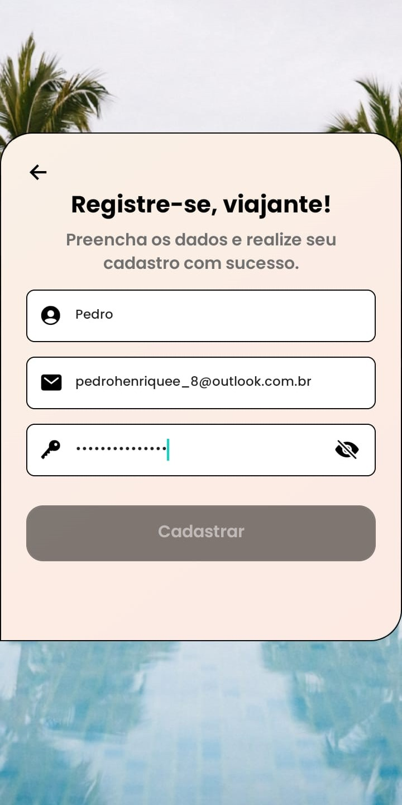
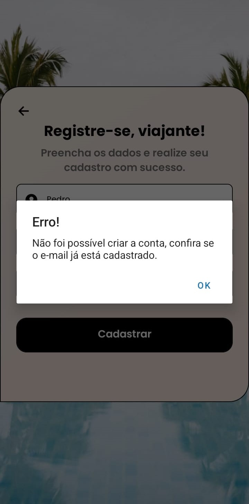
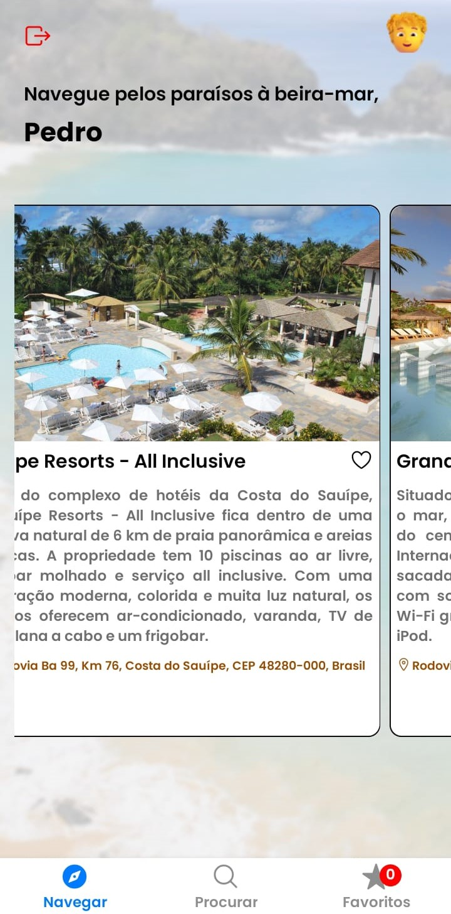
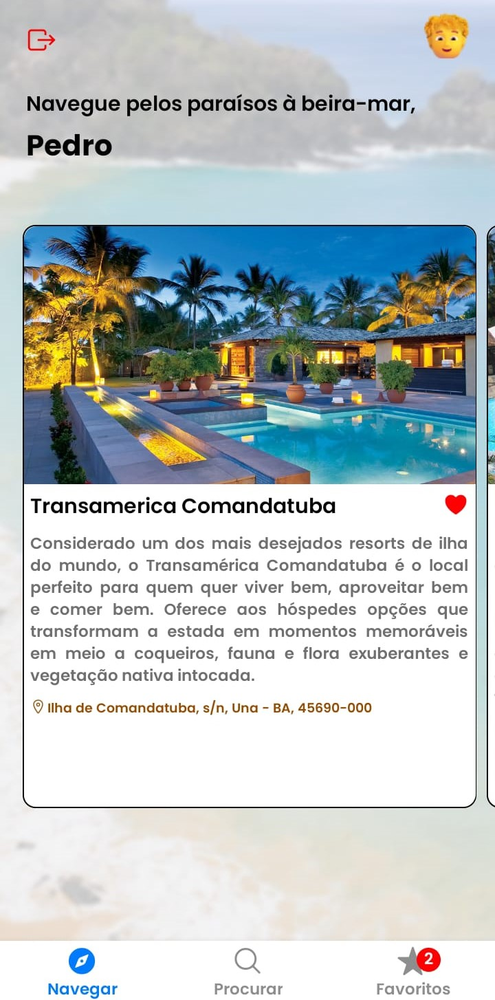
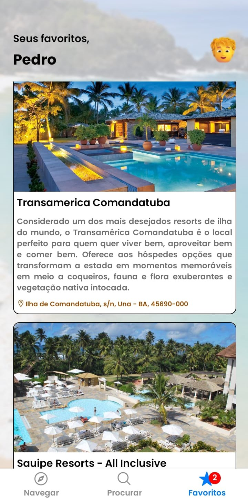
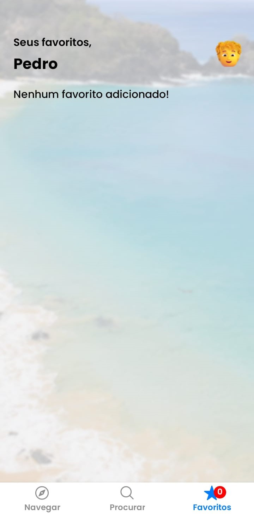
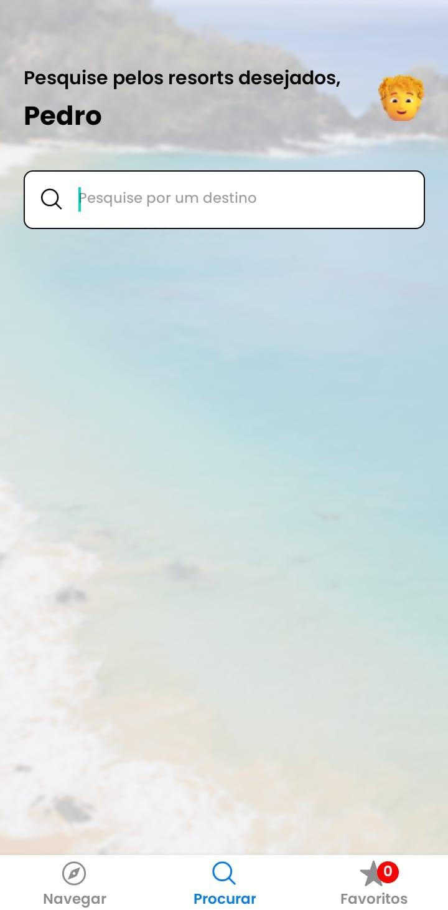
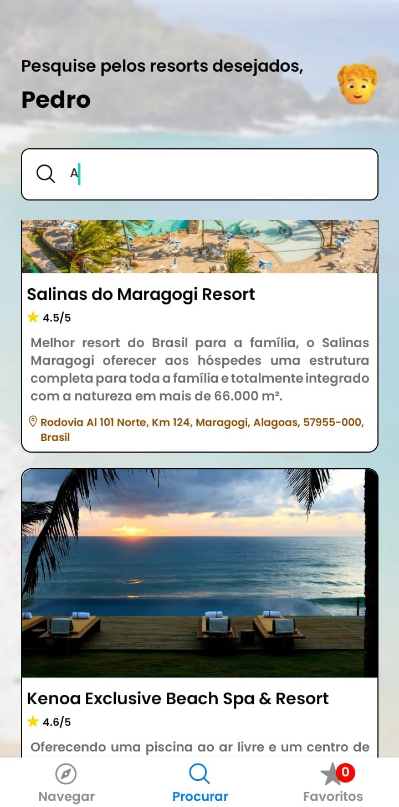
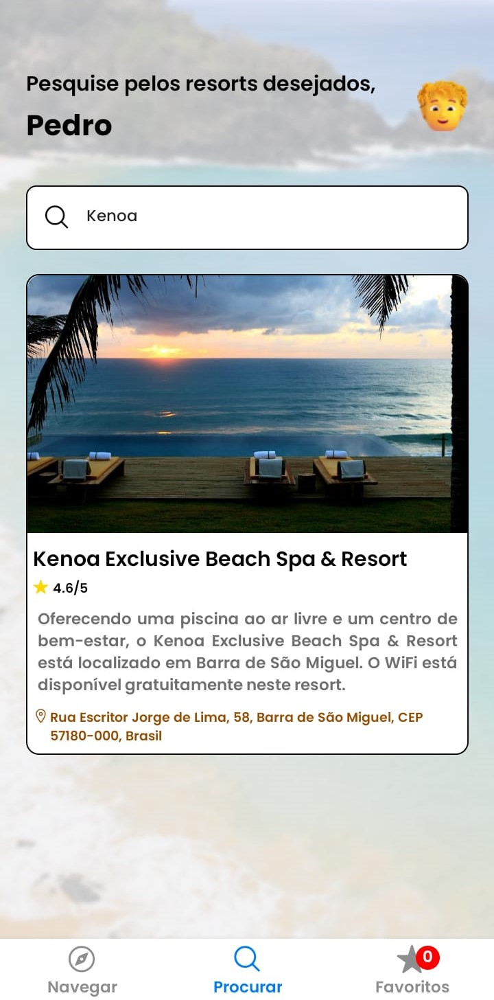

## Resultados das telas do aplicativo

Nessa seção, em síntese, serão apresentados os resultados das telas do aplicativo, bem como as funcionalidades implementadas.

    

        <h3>Figura 1 - SplashPage</h3>
            
    

    
A Figura 1 expressa a tela inicial do aplicativo, apresentando uma logo que assemelha-se ao cenário de resorts.

    

        <h3>Figura 2 - LandingPage</h3>
            
    

    
A Figura 2 encontra-se após a SplashPage, fazendo uma breve introdução acerca do aplicativo. Para prosseguir, o usuário deve pressionar o botão que apresenta o ícone de avião.

    

        <h3>Figura 3 - Login</h3>
            
    

    
A Figura 3 indica a tela de login, que encontra-se após a LandingPage, em que o usuário digita as suas credenciais para ter acesso ao aplicativo.

    

        <h3>Figura 4 - Registro</h3>
            
    

    
A Figura 4 exibe o formulário de cadastro do aplicativo, em que, ao pressionar o botão de cadastrar, o usuário irá inserir um novo registro no banco de dados de users.

    

        <h3>Figura 5 - Registrado com sucesso</h3>
            
    

    
A Figura 5 apresenta uma mensagem de sucesso ao usuário caso o cadastro tenha sido realizado corretamente.

    

        <h3>Figura 6 - Erro ao registrar</h3>
            
    

    
A Figura 6 apresenta uma mensagem de erro ao usuário caso o email inserido já exista no banco de dados.

    

        <h3>Figura 7 - Login com credenciais</h3>
            
    

    
A Figura 7 exibe como o usuário deve inserir suas credenciais para ter acesso ao aplicativo.

    

        <h3>Figura 8 - Erro ao logar</h3>
            
    

    
A Figura 8 apresenta uma mensagem de erro ao usuário caso as credenciais estejam inválidas.

    

        <h3>Figura 9 - Tela inicial</h3>
            
    

    
A Figura 9 exibe a tela inicial do aplicativo, contendo todos os resorts existentes no banco de dados para o usuário explorar e conhecer um pouco sobre cada um. Além disso, na região superior à esquerda, há um ícone para o usuário, caso deseje, deslogar da sua conta.

    

        <h3>Figura 10 - Favoritando resorts</h3>
            
    

    
A Figura 10 indica como o usuário precisa fazer para favoritar os resorts que tenha se interessado, em que serão direcionados para a seção de Favoritos.

    

        <h3>Figura 11 - Lista de favoritos</h3>
            
    

    
A Figura 11, por sua vez, exibe uma lista de resorts favoritados, caso o usuário tenha selecionado algum.

    

        <h3>Figura 12 - Sem favoritos</h3>
            
    

    
Em contrapartida, a Figura 12 apresenta uma mensagem caso o usuário não tenha selecionado nenhum resort como favorito até o momento.

    

        <h3>Figura 13 - Seção de pesquisa</h3> 
            
    

    
A Figura 13 demonstra a seção de pesquisa para o usuário explorar os resorts que deseja mediante o nome.

    

        <h3>Figura 14 - Pesquisando por resorts</h3>    
            
    

    
A Figura 14 exibe os resorts por intermédio da pesquisa feita pelo usuário.

    

        <h3>Figura 15 - Pesquisando por um resort em específico</h3>
        
    

    
Por fim, a Figura 15 apresenta uma busca feita pelo usuário para encontrar um resort em específico.

